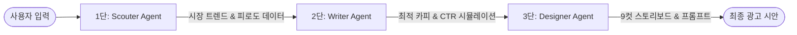

# 📊 Forcans Ad Creative Analysis & System
> **G-Stack 기반 멀티 에이전트 광고 기획 자동화 시스템 (Agentic PoE)**

---

## 📽 프로젝트 개요 (Overview)
**Forcans Ad Creative System**은 퍼포먼스 마케팅 단계에서 발생하는 '광고 소재 피로도' 문제를 해결하기 위해 설계된 **지능형 멀티 에이전트 시스템**입니다. 

단순한 생성 AI를 넘어, 시장 트렌드 분석부터 시각화 전략까지 각 단계별 전문 에이전트가 협업하는 **G-Stack 아키텍처**를 채택하여 광고 제작 효율을 **70% 이상** 개선합니다.

---

## 🧠 G-Stack 서브 에이전트 작업 루트 (Workflow Route)

본 프로젝트는 3단계의 전문 서브 에이전트가 순차적으로 데이터를 가공하며 최종 기획안을 도출하는 **Agentic Pipeline**을 따릅니다.

### 🔄 Agent Interaction Flow

### 1단계: 🕵️ Scouter Agent (시장 분석 루트)
- **Role**: 입력된 카테고리에 대해 **Tavily 실시간 검색 API**를 활용하여 데이터 수집.
- **Input**: { 카테고리, 상품 정보 }.
- **Output**: { 현재 유행 키워드, 피해야 할 피로 문구(Skip trigger), 실시간 시장 인사이트 }.
- **Logic**: 시장의 실시간 '노이즈'를 제거하고 가장 유효한 소구점의 Raw 데이터를 확보합니다.

### 2단계: ✍️ Writer Agent (내러티브 설계 루트)
- **Role**: Scouter의 분석 결과를 재료로 사용자의 브랜드 톤에 맞춰 카피 생성.
- **Input**: { Scouter 인사이트, 선택된 광고 톤 }.
- **Output**: { 광고 카피 12안, 데이터 기반 예상 클릭률(CTR) 시뮬레이션 }.
- **Logic**: 확률적 알고리즘을 결합하여 타겟별 성과 예측 데이터를 도출하고 기획자의 의사결정을 돕습니다.

### 3단계: 🎨 Designer Agent (비주얼 디렉팅 루트)
- **Role**: 선정된 카피를 9컷의 시각적 스토리로 구체화.
- **Input**: { 선정된 카피, 매체 포맷(16:9, 1:1 등) }.
- **Output**: { 9컷 비주얼 스토리보드, 연출 가이드, AI 이미지 생성용 프롬프트 }.
- **Logic**: 단순한 텍스트를 시각 언어로 변환하며, 실시간 피드백 루프를 통해 시안을 즉시 수정 가능하게 합니다.

---

## 📸 주요 실행 화면 (Screenshots)

### 1. 상품 정보 입력 및 Scouter 분석 시작

### 2. 고효율 키워드 분석 및 마케팅 인사이트 도출

### 3. AI 기반 카피 생성 및 성과 시뮬레이션 (Writer)

### 4. 9컷 비주얼 가이드 및 이미지 프롬프트 자동화 (Designer)

---

## 🛠 기술 스택 (Tech Stack)

- **Framework**: Next.js 14 (App Router), TypeScript
- **Agent Orchestration**: **G-Stack** (Multi-agent Route Handlers)
- **Search Engine**: Tavily Search AI
- **LLM**: OpenAI GPT-4o, Claude 3.5 Sonnet
- **Styling**: Tailwind CSS, Framer Motion
- **Management**: Markdown-based Prompt Engineering (`.agents/`)

---

## 📄 라이선스 (License)
본 프로젝트는 개인 포트폴리오 및 AI 서비스 PoC 목적으로 제작되었습니다.

---
**Contact:** [강민석 (ggangminmin)](https://github.com/ggangminmin)
