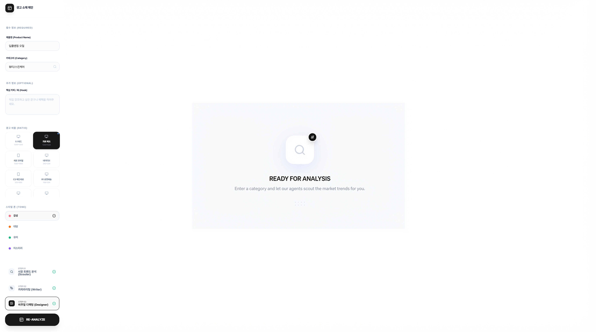
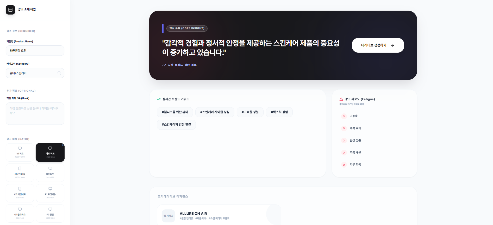
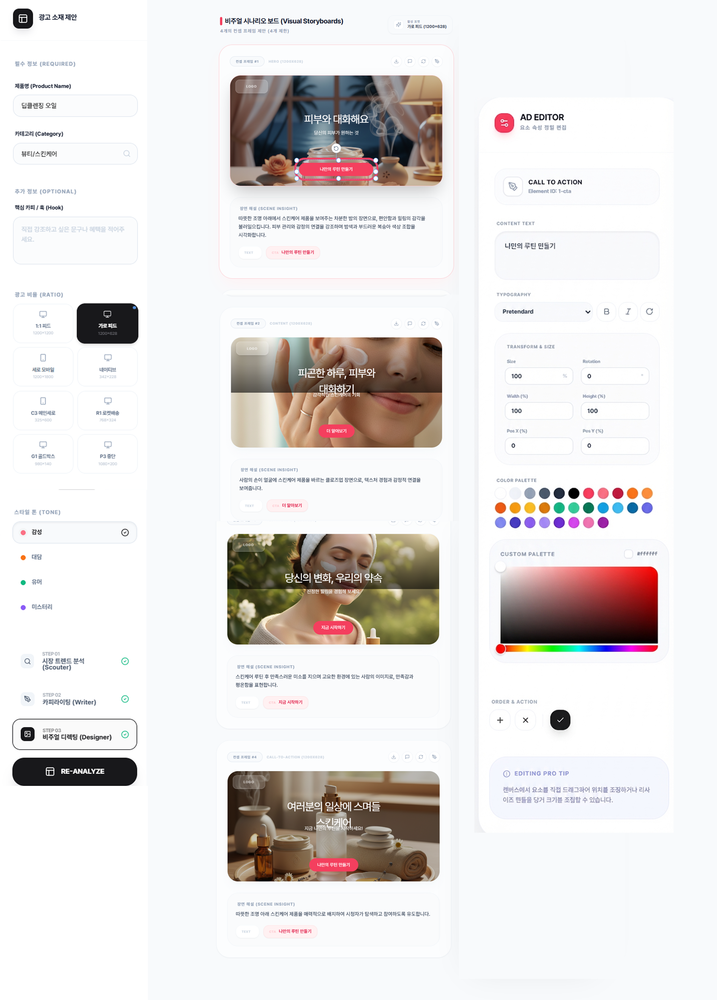
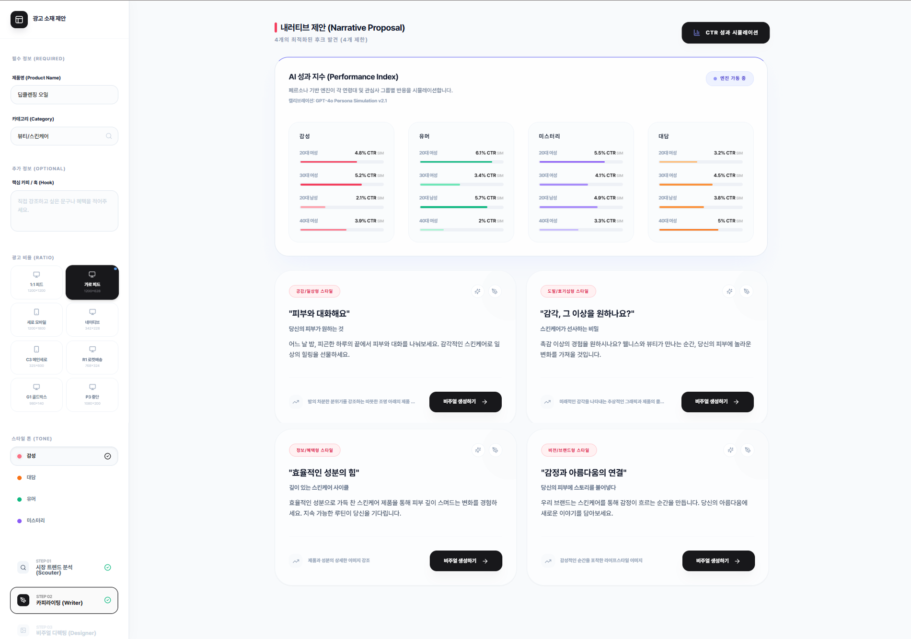

# 📊 Forcans Ad Creative Analysis & System
> **광고 소재 최적화 및 자동 제안 시스템: 퍼포먼스 마케팅 효율 극대화를 위한 AI 솔루션 (PoC)**


---

## 📽 프로젝트 개요 (Overview)
**Forcans Ad Creative System**은 퍼포먼스 마케팅 시장에서 발생하는 '광고 소재 피로도' 문제를 해결하기 위해 설계된 AI 기반 분석 및 제안 시스템입니다. 기존 광고 성과 데이터를 분석하고 실시간 경쟁사 트렌드를 스캔하여, 클릭률(CTR)이 높은 새로운 광고 소재(이미지/문구)를 자동으로 기획하고 제안합니다.

- **목표**: 광고 소재 기획 공수 절감 및 데이터 기반의 객체적 소구점 도출
- **핵심 성과**: 소재 제작 및 테스트 준비 시간 **70% 절감**
- **데모 링크**: [Forcans Ad Creative Analysis](https://forcans-ad-creative-analysis.vercel.app/ad-creative)

---

## 🔍 케이스 스터디 (Case Study)

### 1단계: 문제 정의 (Problem Definition)
퍼포먼스 마케팅 시장의 광고 피로도 상승으로 인한 CTR 하락. 매번 새로운 소구점을 찾아 대량의 광고를 수동으로 제작하는 데 막대한 리소스가 소요되는 현상 발생.

### 2단계: AI 적용 근거 (AI Rationale)
실시간 경쟁사 데이터를 스캔하여 경쟁력이 높은 키워드를 추출하고, 생성형 AI를 활용해 수백 개의 광고 베리에이션을 즉각적으로 생성하여 A/B 테스트의 속도와 정확도를 높이기 위함.

### 3단계: 기획 과정 (Planning Process)
- **Scouter 엔진**: 실시간 웹 데이터 기반 광고 피로도 및 키워드 분석
- **CTR 시뮬레이션**: 타겟 성별/연령 기반 성과 예측 로직 설계
- **AD Editor**: 브랜드 톤별 4종 카피 제안 및 매체 비율 대응 레이아웃 설계

### 4단계: 결과 및 지표 (Results & Metrics)
소재 제작 및 테스트 준비 시간을 기존 대비 **70% 절감**하였으며, AI 제안 소구점 기반 소재가 기존 수동 제작 소재 대비 우수한 성과 예측치를 기록.

---

## ✨ 핵심 기능 (Key Features)

| 기능 | 상세 설명 |
| :--- | :--- |
| **🕵️ Scouter Engine** | 실시간 트렌드 및 경쟁사 소재 스캐닝을 통한 소구점 추출 |
| **📈 CTR Simulation** | 타겟 오디언스별 예상 클릭률 시뮬레이션 및 데이터 시각화 |
| **✍️ Copywriting Editor** | 브랜드 톤앤매너(Friendly, Professional 등) 기반 카피 자동 생성 |
| **🎨 Banner Builder** | 비주얼 구성 요소 제안 및 이미지 생성용 AI 프롬프트 자동화 |

---

## 📸 주요 화면 (Screenshots)

### 1. 데이터 분석 및 소구점 도출


### 2. 고효율 키워드 분석 및 트렌드 매핑


### 3. AI 기반 카피라이팅 및 성과 시뮬레이션


### 4. 최종 배너 시안 및 비주얼 가이드


---

## 🛠 설치 및 시작하기 (Getting Started)

### Local Run
```bash
npm install
npm run dev:node20
```

### Vercel Deploy
1. GitHub 레포지토리를 Vercel에 임포트합니다.
2. 다음 환경 변수를 추가합니다:
   - `VITE_OPENAI_API_KEY`
   - `VITE_TAVILY_API_KEY`
   - `VITE_GEMINI_API_KEY`

---

## 📄 라이선스 (License)
본 프로젝트는 개인 포트폴리오 및 AI 서비스 PoC 목적으로 제작되었습니다.

---
**Contact:** [강민석](https://github.com/ggangminmin)
